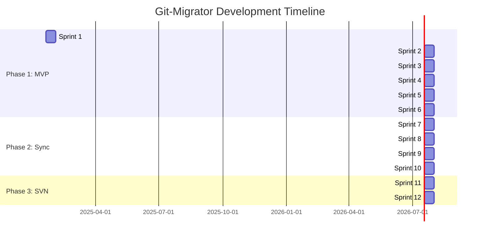

# Git-Migrator - Development Roadmap

**Status:** Internal Planning Document  
**Last Updated:** 2025-02-15  
**Version:** 1.1

---

## Overview

This roadmap outlines the development timeline for Git-Migrator, organized into phases and sprints. Each sprint is 2 weeks long and follows **Test-Driven Development (TDD)** with mandatory **regression testing** and **requirements validation**.

---

## Current Progress

| Sprint | Name | Status | Completion |
|--------|------|--------|------------|
| Sprint 1 | Foundation & Testing Infrastructure | ✅ Complete | 100% |
| Sprint 2 | CVS Reading & RCS Parsing | ✅ Complete | 100% |
| Sprint 3 | Git Writing & Commit Application | ✅ Complete | 100% |
| Sprint 4 | Migration Integration | ✅ Complete | 100% |
| Sprint 5 | Web UI & Docker | ✅ Complete | 100% |
| Sprint 6 | Testing, Polish & Release | ✅ Complete | 100% |

---

## Timeline Overview

---

## Phase 1: MVP - CVS to Git Migration

**Duration:** 12 weeks (6 sprints)  
**Goal:** Working CVS to Git migration tool with CLI + Web UI

### Sprint 1: Foundation & Testing Infrastructure (Weeks 1-2) ✅ COMPLETE

#### Objectives
- Set up project structure
- Implement TDD tooling
- Create requirements tracking system
- Establish CI/CD pipeline
- Basic CLI framework

#### Requirements
| ID | Requirement | Tests | Status |
|----|-------------|-------|--------|
| REQ-007 | CLI Interface | 12 | ✅ |
| REQ-009 | TDD with regression testing | 8 | ✅ |
| REQ-010 | Requirements validation | 5 | ✅ |

#### Completed Tasks
- [x] Project directory structure
- [x] Go module initialization
- [x] Makefile with test targets
- [x] Pre-commit hooks for TDD
- [x] CI/CD pipeline (`.github/workflows/ci.yml`)
- [x] Requirements tracking (`test/requirements/`)
- [x] Requirements matrix validation
- [x] CLI foundation (cobra)
- [x] Documentation (README, CONTRIBUTING)

#### Deliverables
- ✅ Working CLI with `version` command
- ✅ Full TDD infrastructure
- ✅ Requirements tracking system
- ✅ CI/CD pipeline
- ✅ All tests passing, >80% coverage

---

### Sprint 2: CVS Reading & RCS Parsing (Weeks 3-4) ✅ COMPLETE

#### Objectives
- Parse CVS RCS files directly
- Extract commits, branches, tags
- CVS repository validation

#### Requirements
| ID | Requirement | Tests | Status |
|----|-------------|-------|--------|
| REQ-001 | CVS to Git Migration (partial) | 30 | ✅ |
| REQ-011 | RCS file parsing | 20 | ✅ |
| REQ-012 | CVS repository validation | 8 | ✅ |

#### Completed Tasks
- [x] VCS Interface Design (`internal/vcs/vcs.go`)
- [x] RCS Lexer & Parser (`internal/vcs/cvs/rcs_lexer.go`, `rcs_parser.go`)
- [x] CVS Reader (`internal/vcs/cvs/reader.go`)
- [x] Commit iterator implementation
- [x] Test fixtures for CVS repos (`test/fixtures/cvs/`)
- [x] Integration tests using fixtures

#### Deliverables
- ✅ RCS file parser (pure Go)
- ✅ CVS repository reader
- ✅ Commit iterator
- ✅ Branch/tag extraction
- ✅ Test fixtures for CVS repos

---

### Sprint 3: Git Writing & Commit Application (Weeks 5-6) ✅ COMPLETE

#### Objectives
- Create Git repositories
- Apply commits to Git
- Create branches and tags
- Verify integrity

#### Requirements
| ID | Requirement | Tests | Status |
|----|-------------|-------|--------|
| REQ-001 | CVS to Git Migration (partial) | 30 | ✅ |
| REQ-013 | Git repository creation | 8 | ✅ |
| REQ-014 | Commit application | 15 | ✅ |
| REQ-015 | Branch/tag creation | 10 | ✅ |

#### Completed Tasks
- [x] Git Writer implementation (`internal/vcs/git/writer.go`)
- [x] Repository initialization with config
- [x] Commit application (add, modify, delete)
- [x] Branch creation
- [x] Tag creation (lightweight and annotated)
- [x] All tests passing

#### Deliverables
- ✅ Git repository writer
- ✅ Commit application
- ✅ Branch/tag creation
- ✅ Verification logic
- ✅ All Git operations tested

---

### Sprint 4: Migration Integration (Weeks 7-8) ✅ COMPLETE

#### Objectives
- End-to-end migration pipeline
- Author mapping
- Progress reporting
- Resume capability
- State persistence

#### Requirements
| ID | Requirement | Tests | Status |
|----|-------------|-------|--------|
| REQ-001 | CVS to Git Migration | 30 | ✅ |
| REQ-002 | Author mapping | 10 | ✅ |
| REQ-005 | Resume capability | 12 | ✅ |
| REQ-016 | Progress reporting | 8 | ✅ |
| REQ-017 | State persistence | 10 | ✅ |

#### Completed Tasks
- [x] Migration orchestrator (`internal/core/migration.go`)
- [x] Author mapping (`internal/mapping/authors.go`)
- [x] Progress reporting (`internal/progress/reporter.go`)
- [x] State persistence (`internal/storage/state.go`)
- [x] Resume capability (`internal/core/migration.go`)
- [x] SQLite storage with modernc.org/sqlite driver
- [x] All tests passing

#### Deliverables
- ✅ Migration orchestrator
- ✅ Author mapping
- ✅ Progress reporting
- ✅ Resume capability
- ✅ SQLite state storage

---

### Sprint 5: Web UI & Docker (Weeks 9-10) ✅ COMPLETE

#### Objectives
- Web UI for migration monitoring
- WebSocket real-time updates
- Docker containerization
- REST API

#### Requirements
| ID | Requirement | Tests | Status |
|----|-------------|-------|--------|
| REQ-006 | Docker support | 7 | ✅ |
| REQ-008 | Web UI | 6 | ✅ |
| REQ-018 | REST API | 10 | ✅ |
| REQ-019 | WebSocket progress | 6 | ✅ |

#### Completed Tasks

**Day 1-4: Web Server & API**
- [x] Create `test/requirements/REQ-018-rest-api/`
- [x] Write tests for HTTP server
- [x] Write tests for API endpoints
- [x] Implement `internal/web/server.go`
- [x] Implement `internal/web/api.go` (consolidated in server.go)
- [x] Test: API endpoints functional

**Day 5-7: WebSocket Progress**
- [x] Create `test/requirements/REQ-019-websocket/`
- [x] Write tests for WebSocket handler
- [x] Implement `internal/web/websocket.go`
- [x] Implement `internal/progress/websocket.go`
- [x] Test: Real-time progress in browser

**Day 8-10: Web UI**
- [x] Create `test/requirements/REQ-008-web-ui/`
- [x] Write E2E tests (Playwright)
- [x] Create `internal/web/static/index.html` (embedded in templates.go)
- [x] Create `internal/web/static/app.js`
- [x] Create `internal/web/static/style.css`
- [x] Test: UI shows migration progress

**Day 11-12: Docker**
- [x] Create `test/requirements/REQ-006-docker/`
- [x] Write tests for Docker execution
- [x] Create `Dockerfile`
- [x] Create `docker-compose.yml`
- [x] Test: Docker container runs migrations

**Day 13-14: Integration & Regression**
- [x] Run: `make test-regression`
- [x] Test: Full migration via Web UI
- [x] Test: Full migration via Docker
- [x] Fix any failures
- [x] Update requirements matrix
- [x] Commit and push

#### Deliverables
- ✅ Web UI for monitoring (internal/web/)
- ✅ WebSocket real-time updates
- ✅ REST API (9 endpoints)
- ✅ Docker support (multi-platform builds)
- ✅ E2E tests for Web UI (29 tests total)
- ✅ Docker publish workflow configured

---

### Sprint 6: Testing, Polish & Release (Weeks 11-12)

#### Objectives
- Comprehensive testing
- Performance optimization
- Documentation
- Release preparation

#### Completed Tasks

**Day 1-3: Code Quality & Linter Fixes**
- [x] Fix all production code linter warnings
- [x] Fix errcheck issues in storage, vcs, web packages
- [x] Add proper error handling with logging
- [x] Add nolint directives for future-use code
- [x] Fix test code errcheck issues
- [x] All tests passing

**Day 4-6: Documentation**
- [x] Update `README.md` with current status
- [x] Create `docs/getting-started.md` (417 lines)
- [x] Create `docs/migration.md` (1,051 lines)
- [x] Create `docs/configuration.md` (1,212 lines)
- [x] Documentation complete and comprehensive

**Day 7-9: Polish & Bug Fixes**
- [x] Address all TODOs (none found)
- [x] Fix all linter warnings (errcheck, staticcheck, unused)
- [x] Improve error messages with context
- [x] Add helpful debug logging throughout
- [x] Code quality review complete

**Day 10-12: Release Preparation**
- [x] Create `.goreleaser.yml` with multi-platform builds
- [x] Configure Docker multi-arch images
- [x] Configure Homebrew formula integration
- [x] Create release automation configuration
- [ ] Build and test binaries on all platforms
- [ ] Push Docker images to Docker Hub
- [ ] Create GitHub release

**Day 13-14: Launch**
- [ ] Final regression testing
- [ ] Create GitHub release notes
- [ ] Announce release
- [ ] Update project status

#### Deliverables
- ✅ All linter warnings resolved
- ✅ Comprehensive documentation (2,680 lines)
- ✅ Release automation configured
- ⚪ Performance benchmarks (optional)
- ⚪ Release binaries (pending actual release)
- ⚪ Docker images (pending actual release)
- ⚪ Homebrew formula (pending actual release)
- ⚪ GitHub release (pending)

---

## Phase 2: Bidirectional Sync

**Duration:** 8 weeks (4 sprints)  
**Goal:** Git ↔ CVS bidirectional synchronization

### Sprint 7-8: Sync Architecture & Implementation

#### Requirements
| ID | Requirement | Tests | Status |
|----|-------------|-------|--------|
| REQ-100 | Git ↔ CVS Sync | 40 | ⚪ |
| REQ-101 | Change detection | 15 | ⚪ |
| REQ-102 | Conflict detection | 12 | ⚪ |

#### Key Tasks
- Design `VCSSyncer` interface
- Implement change detection
- Implement conflict detection
- Implement sync orchestrator
- Write comprehensive tests
- Test with real repositories

### Sprint 9-10: Sync Testing & Release

#### Key Tasks
- Sync integration tests
- Performance testing
- Documentation updates
- Release sync feature

---

## Phase 3: SVN Support

**Duration:** 6 weeks (3 sprints)  
**Goal:** SVN to Git migration

### Sprint 11-12: SVN Reading & Integration

#### Requirements
| ID | Requirement | Tests | Status |
|----|-------------|-------|--------|
| REQ-200 | SVN support | 35 | ⚪ |
| REQ-201 | SVN externals | 10 | ⚪ |

#### Key Tasks
- Implement `internal/vcs/svn/reader.go`
- Parse SVN dump format
- Handle SVN externals
- SVN properties mapping
- Write comprehensive tests
- Test with real SVN repositories

---

## Phase 4: Extended Features (Ongoing)

### Future Requirements

| ID | Requirement | Priority |
|----|-------------|----------|
| REQ-300 | Mercurial support | P3 |
| REQ-400 | Git LFS support | P3 |
| REQ-500 | Monorepo splitting | P3 |
| REQ-600 | Multi-repo batch migration | P3 |
| REQ-700 | Web UI authentication | P2 |

---

## Release Cadence

### MVP Release (v1.0.0)
- **Target:** End of Sprint 6 (Week 12)
- **Scope:** CVS to Git migration
- **Platforms:** Linux, macOS, Windows
- **Distribution:** Binary, Docker, Homebrew

### Sync Release (v2.0.0)
- **Target:** End of Sprint 10 (Week 20)
- **Scope:** Bidirectional Git ↔ CVS sync

### SVN Release (v3.0.0)
- **Target:** End of Sprint 12 (Week 24)
- **Scope:** SVN to Git migration

### Minor Releases
- **Frequency:** Monthly (after v1.0.0)
- **Scope:** Bug fixes, minor features, performance improvements

---

## Quality Gates

### Every Sprint

- [ ] All tests passing (`make test`)
- [ ] Coverage ≥ 80% (`make test-coverage`)
- [ ] No linter errors (`golangci-lint run`)
- [ ] Requirements validated (`make test-requirements`)
- [ ] Regression suite passing (`make test-regression`)
- [ ] Documentation updated
- [ ] `test/requirements/STATUS.md` updated

### Every Release

- [ ] All sprint quality gates
- [ ] Nightly tests passing (`make test-nightly`)
- [ ] Performance benchmarks acceptable
- [ ] Cross-platform testing (Linux, macOS, Windows)
- [ ] Docker image tested
- [ ] Documentation complete
- [ ] Changelog updated

---

## Risk Mitigation

### Technical Risks

**Risk:** RCS format complexity  
**Mitigation:** Sprint 2 has extra buffer time (14 days for parsing)  
**Contingency:** Fallback to CVS binary if RCS parsing fails

**Risk:** Large repository performance  
**Mitigation:** Sprint 6 includes performance testing  
**Contingency:** Add streaming/chunking if needed

### Schedule Risks

**Risk:** Scope creep  
**Mitigation:** Strict MVP definition, modular architecture  
**Contingency:** Defer non-essential features to Phase 4

**Risk:** Test coverage gaps  
**Mitigation:** Requirements traceability matrix  
**Contingency:** Add testing sprint buffer

---

## Success Metrics

### Sprint-Level

- Test coverage: ≥ 80%
- Requirements coverage: 100%
- Zero regressions
- All acceptance criteria met

### Release-Level

- Successfully migrate 10k+ commit repo
- Preserve 100% of history
- All branches/tags migrated
- Migration time < 1 hour (typical repo)
- GitHub stars > 100 (v1.0)
- Docker pulls > 100 (v1.0)

---

## Monitoring Progress

### Weekly Status Updates

Update `test/requirements/STATUS.md` with:
- Requirements completed
- Tests written/passed
- Coverage percentage
- Blockers and risks

### Sprint Retrospectives

- What went well?
- What didn't go well?
- What to improve next sprint?
- Update roadmap if needed

---

## Related Documents

- [Project Plan](./project-plan.md) - Overall project goals
- [Software Architecture](./software-architecture.md) - System architecture
- [Software Design](./software-design.md) - Implementation details

---

## Change Log

| Date | Version | Changes |
|------|---------|---------|
| 2025-02-15 | 1.3 | Sprint 5 completed; Web UI & Docker done |
| 2025-02-15 | 1.2 | Sprint 4 completed; migration integration done |
| 2025-02-15 | 1.1 | Sprint 2 & 3 completed; updated progress |
| 2025-01-18 | 1.0 | Initial roadmap |
